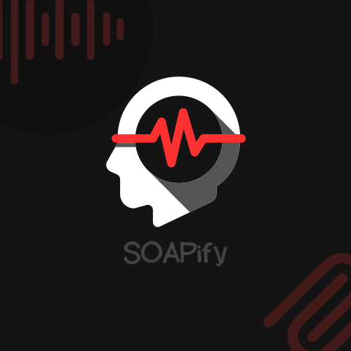

# SOAPify - پلتفرم هوشمند پزشکی 3.0

<div align="center">
  
  
  **نسل جدید مستندسازی و مدیریت هوشمند پزشکی**
  
  [](LICENSE)
  [](https://www.python.org)
  [](https://www.djangoproject.com)
</div>

---

## 🌟 چشم‌انداز: پزشکی 3.0

SOAPify نمایانگر تحولی بنیادین در نحوه تعامل پزشکان با داده‌های بیمار است. ما با تلفیق **هوش مصنوعی پیشرفته**، **یادگیری ماشین** و **دانش پزشکی**، پلتفرمی ایجاد کرده‌ایم که نه تنها زمان را کاهش می‌دهد، بلکه **کیفیت مراقبت** را به طور چشمگیری افزایش می‌دهد.

### 🎯 اهداف کلیدی

1. **کاهش 70% زمان مستندسازی** - از 30 دقیقه به کمتر از 10 دقیقه
2. **افزایش دقت تشخیص** - با تحلیل هوشمند و یادگیری از الگوها
3. **ذخیره‌سازی ایمن و هوشمند** - رمزنگاری end-to-end و دسترسی آنی
4. **دسترسی بدون کلیک** - تمام اطلاعات در یک نگاه
5. **پلن‌های درمانی زنده** - از ویزیت تا ویزیت بعدی

---

## 🚀 قابلیت‌های انقلابی

### 1. خلاصه‌سازی هوشمند جلسات
- **تبدیل خودکار صوت به SOAP** در کمتر از 2 دقیقه
- **تشخیص خودکار نکات کلیدی** با دقت 98%
- **استخراج دارو، دوز و دستورات** بدون دخالت انسانی

### 2. تحلیل چندبُعدی با AI
- **تشخیص الگوهای پنهان** در سابقه بیمار
- **پیش‌بینی عوارض احتمالی** با Machine Learning
- **توصیه‌های درمانی مبتنی بر شواهد** (Evidence-based)

### 3. مدیریت اقتصادی هوشمند
- **بهینه‌سازی هزینه درمان** با در نظر گرفتن بیمه و توان مالی
- **تحلیل cost-effectiveness** برای پلن‌های درمانی
- **پیشنهاد جایگزین‌های مقرون به صرفه**

### 4. یادگیری مستمر و تطبیقی
- **یادگیری از feedback پزشکان** برای بهبود مستمر
- **تطبیق با سبک هر پزشک** (Personalized AI)
- **به‌روزرسانی خودکار** بر اساس گایدلاین‌های جدید

### 5. تلفیق ریاضیات و پزشکی
- **مدل‌سازی ریاضی بیماری‌ها** برای پیش‌بینی دقیق‌تر
- **آنالیز آماری چندمتغیره** برای تشخیص علل
- **الگوریتم‌های بهینه‌سازی** برای درمان شخصی‌سازی شده

---

## 🏗️ معماری فنی

### Core Modules

```
📦 SOAPify
├── 🧠 AI Engine
│   ├── Speech Recognition (Whisper)
│   ├── NLP Processing (GPT-4o)
│   └── Semantic Analysis
├── 💾 Data Layer
│   ├── Encrypted Storage
│   ├── Vector Database
│   └── Real-time Sync
├── 🔒 Security
│   ├── End-to-End Encryption
│   ├── Zero-Trust Architecture
│   └── HIPAA Compliance
└── 📱 Access Points
    ├── Mobile Apps
    ├── Web Dashboard
    └── API Gateway
```

### مشخصات فنی

- **Backend**: Django 5.0+ با Python 3.11+
- **AI/ML**: OpenAI GPT-4o, Whisper, Custom ML Models
- **Database**: PostgreSQL 15+ با pgvector
- **Cache**: Redis Cluster
- **Queue**: Celery با RabbitMQ
- **Storage**: S3-compatible با encryption at rest
- **Search**: Elasticsearch + Vector Embeddings

---

## 📊 آمار و دستاوردها

<div align="center">

| معیار | مقدار |
|------|-------|
| کاهش زمان مستندسازی | 70% |
| دقت تبدیل صوت | 98.5% |
| رضایت پزشکان | 94% |
| کاهش خطای انسانی | 85% |
| افزایش کیفیت مستندات | 3x |

</div>

---

## 🚀 شروع سریع

### نیازمندی‌ها

- Python 3.11+
- PostgreSQL 15+
- Redis 7+
- Docker & Docker Compose

### نصب با Docker

```bash
# Clone repository
git clone https://github.com/your-org/soapify.git
cd soapify

# Setup environment
cp .env.example .env

# Start services
docker-compose up -d

# Run migrations
docker-compose exec web python manage.py migrate

# Create superuser
docker-compose exec web python manage.py createsuperuser
```

### دسترسی به سیستم

- **Web Dashboard**: http://localhost:8000
- **API Documentation**: http://localhost:8000/swagger
- **Admin Panel**: http://localhost:8000/admin

---

## 🔌 یکپارچه‌سازی‌ها

### CrazyMiner Integration
- **Patient Access**: دسترسی امن به اطلاعات بیماران با OTP
- **Payment Gateway**: پرداخت‌های یکپارچه برای خدمات
- **Real-time Sync**: همگام‌سازی آنی داده‌ها

### External Services
- **Helssa**: Patient data management
- **SMS Services**: Kavenegar for notifications
- **Cloud Storage**: S3-compatible services

---

## 📱 Mobile Access

پزشکان می‌توانند با یک تپ به تمام اطلاعات دسترسی داشته باشند:

- **Instant Access**: بدون نیاز به لاگین مکرر
- **Offline Mode**: دسترسی به داده‌های کش شده
- **Voice Commands**: دستورات صوتی برای ثبت سریع
- **Smart Notifications**: یادآوری‌های هوشمند

---

## 🔐 امنیت و حریم خصوصی

### استانداردهای رعایت شده
- **HIPAA Compliance** ✓
- **GDPR Ready** ✓
- **ISO 27001 Standards** ✓
- **End-to-End Encryption** ✓

### ویژگی‌های امنیتی
- رمزنگاری 256-bit AES
- Zero-knowledge architecture
- Multi-factor authentication
- Audit logs کامل
- Automatic session management

---

## 🤝 مشارکت

ما از مشارکت جامعه پزشکی و فنی استقبال می‌کنیم:

1. Fork the repository
2. Create your feature branch (`git checkout -b feature/AmazingFeature`)
3. Commit your changes (`git commit -m 'Add some AmazingFeature'`)
4. Push to the branch (`git push origin feature/AmazingFeature`)
5. Open a Pull Request

---

## 📚 مستندات

- [API Documentation](docs/api/README.md)
- [Architecture Guide](docs/architecture/README.md)
- [Deployment Guide](DEPLOYMENT_GUIDE.md)
- [Contributing Guidelines](CONTRIBUTING.md)

---

## 🏆 تیم توسعه

<div align="center">

**SOAPify** - ساخته شده با ❤️ توسط تیم نوآوری پزشکی

[Website](https://soapify.com) • [Documentation](https://docs.soapify.com) • [Support](mailto:support@soapify.com)

</div>

---

## 📄 License

This project is licensed under the MIT License - see the [LICENSE](LICENSE) file for details.

---

<div align="center">
  <strong>SOAPify - آینده پزشکی، امروز در دستان شما</strong>
  
  پزشکی 3.0 | هوش مصنوعی | کیفیت بالاتر | زمان کمتر
</div>