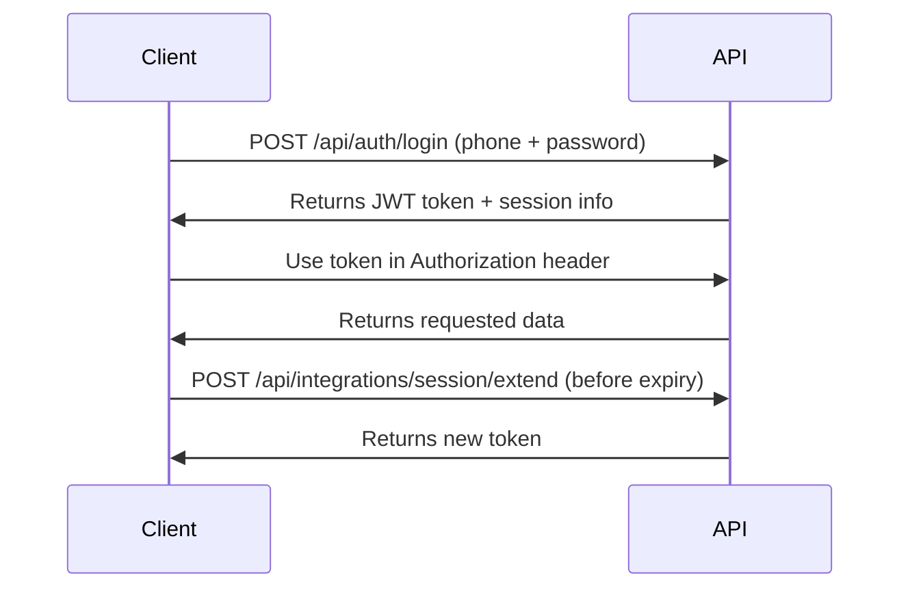

# SOAPify API Reference v1.0

## Table of Contents

1. [Overview](#overview)
2. [Authentication](#authentication)
3. [Base URL & Versioning](#base-url--versioning)
4. [Response Format](#response-format)
5. [Error Handling](#error-handling)
6. [Rate Limiting](#rate-limiting)
7. [API Endpoints](#api-endpoints)
   - [Authentication](#authentication-endpoints)
   - [User Management](#user-management)
   - [Encounters](#encounters)
   - [Audio Processing](#audio-processing)
   - [SOAP Notes](#soap-notes)
   - [Search & Analytics](#search--analytics)
   - [Wallet & Payments](#wallet--payments)
   - [Patient Access](#patient-access)
   - [Integrations](#integrations)

---

## Overview

The SOAPify API is a RESTful API that enables developers to integrate medical documentation and AI-powered SOAP note generation into their applications. All API responses are in JSON format.

### Key Features
- JWT-based authentication with sliding window sessions
- Real-time audio transcription
- AI-powered SOAP note generation
- Semantic search capabilities
- Secure patient data access
- Integrated payment system

---

## Authentication

SOAPify uses JWT (JSON Web Token) authentication with a sliding window mechanism.

### Authentication Flow



### Headers

All authenticated requests must include:
```http
Authorization: Bearer <your-jwt-token>
Content-Type: application/json
```

---

## Base URL & Versioning

```
Production: https://api.soapify.com
Staging: https://staging-api.soapify.com
Local: http://localhost:8000
```

Current API version: `v1` (included in URL path)

---

## Response Format

### Success Response
```json
{
  "success": true,
  "data": {
    // Response data here
  },
  "message": "Operation completed successfully",
  "timestamp": "2024-01-20T10:30:00Z"
}
```

### Error Response
```json
{
  "success": false,
  "error": {
    "code": "ERROR_CODE",
    "message": "Human-readable error message",
    "details": {
      // Additional error details
    }
  },
  "timestamp": "2024-01-20T10:30:00Z"
}
```

---

## Error Handling

### HTTP Status Codes

| Status Code | Description |
|------------|-------------|
| 200 | Success |
| 201 | Created |
| 400 | Bad Request |
| 401 | Unauthorized |
| 403 | Forbidden |
| 404 | Not Found |
| 422 | Validation Error |
| 429 | Too Many Requests |
| 500 | Internal Server Error |

### Common Error Codes

| Error Code | Description |
|-----------|-------------|
| `AUTH_INVALID_CREDENTIALS` | Invalid login credentials |
| `AUTH_TOKEN_EXPIRED` | JWT token has expired |
| `AUTH_SESSION_INVALID` | Session is invalid or expired |
| `VALIDATION_ERROR` | Request validation failed |
| `RESOURCE_NOT_FOUND` | Requested resource not found |
| `INSUFFICIENT_PERMISSIONS` | User lacks required permissions |
| `RATE_LIMIT_EXCEEDED` | Too many requests |

---

## Rate Limiting

- **Default limit**: 100 requests per minute per user
- **Audio upload**: 10 requests per minute
- **AI processing**: 20 requests per minute

Rate limit headers:
```http
X-RateLimit-Limit: 100
X-RateLimit-Remaining: 95
X-RateLimit-Reset: 1642680000
```

---

## API Endpoints

### Authentication Endpoints

#### 1. Send OTP
```http
POST /api/integrations/otp/send/
```

**Request Body:**
```json
{
  "phone_number": "+989123456789",
  "purpose": "login"  // "login" or "register"
}
```

**Response:**
```json
{
  "success": true,
  "data": {
    "otp_sent": true,
    "expires_in_seconds": 300,
    "session_id": "550e8400-e29b-41d4-a716-446655440000"
  }
}
```

**Scenario:**
- User enters phone number
- System sends 6-digit OTP via SMS
- OTP valid for 5 minutes
- Max 3 attempts per OTP

---

#### 2. Verify OTP & Login
```http
POST /api/integrations/otp/verify/
```

**Request Body:**
```json
{
  "phone_number": "+989123456789",
  "otp_code": "123456",
  "session_id": "550e8400-e29b-41d4-a716-446655440000"
}
```

**Response:**
```json
{
  "success": true,
  "data": {
    "jwt_token": "eyJhbGciOiJIUzI1NiIs...",
    "refresh_token": "eyJhbGciOiJIUzI1NiIs...",
    "session_id": "new-session-id",
    "expires_at": "2024-01-20T11:30:00Z",
    "window_duration_minutes": 30,
    "user": {
      "id": 1,
      "username": "dr_smith",
      "phone_number": "+989123456789",
      "role": "doctor",
      "profile": {
        "full_name": "Dr. John Smith",
        "specialty": "General Practice",
        "license_number": "12345"
      }
    }
  }
}
```

---

#### 3. Extend Session
```http
POST /api/integrations/session/extend/
```

**Headers:**
```http
Authorization: Bearer <current-jwt-token>
```

**Request Body:**
```json
{
  "session_id": "current-session-id"
}
```

**Response:**
```json
{
  "success": true,
  "data": {
    "jwt_token": "new-jwt-token",
    "expires_at": "2024-01-20T12:00:00Z",
    "window_duration_minutes": 30
  }
}
```

**Important:** Call this endpoint before token expiry to maintain session continuity.

---

#### 4. Logout
```http
POST /api/integrations/logout/
```

**Headers:**
```http
Authorization: Bearer <jwt-token>
```

**Response:**
```json
{
  "success": true,
  "message": "Logged out successfully"
}
```

---

### User Management

#### 5. Get Current User Profile
```http
GET /api/accounts/me/
```

**Response:**
```json
{
  "success": true,
  "data": {
    "id": 1,
    "username": "dr_smith",
    "email": "smith@example.com",
    "phone_number": "+989123456789",
    "role": "doctor",
    "is_active": true,
    "created_at": "2024-01-01T00:00:00Z",
    "profile": {
      "full_name": "Dr. John Smith",
      "specialty": "General Practice",
      "license_number": "12345",
      "years_of_experience": 10,
      "bio": "Experienced general practitioner...",
      "avatar_url": "https://storage.soapify.com/avatars/user1.jpg"
    }
  }
}
```

---

#### 6. Update User Profile
```http
PATCH /api/accounts/me/
```

**Request Body:**
```json
{
  "email": "newemail@example.com",
  "profile": {
    "full_name": "Dr. John Smith Jr.",
    "bio": "Updated bio text"
  }
}
```

**Response:**
```json
{
  "success": true,
  "data": {
    // Updated user object
  }
}
```

---

### Encounters

#### 7. List Encounters
```http
GET /api/encounters/
```

**Query Parameters:**
- `page` (default: 1)
- `page_size` (default: 20, max: 100)
- `search` - Search in patient names, complaints
- `status` - Filter by status: `pending`, `processing`, `completed`, `failed`
- `date_from` - ISO date string
- `date_to` - ISO date string
- `ordering` - Sort by: `created_at`, `-created_at`, `patient_name`

**Response:**
```json
{
  "success": true,
  "data": {
    "count": 150,
    "next": "https://api.soapify.com/api/encounters/?page=2",
    "previous": null,
    "results": [
      {
        "id": 1,
        "patient_name": "John Doe",
        "patient_age": 45,
        "patient_gender": "male",
        "chief_complaint": "Persistent headache for 3 days",
        "encounter_date": "2024-01-20T09:00:00Z",
        "duration_minutes": 15,
        "status": "completed",
        "audio_file_url": "https://storage.soapify.com/audio/enc1.m4a",
        "transcript_preview": "Patient presents with...",
        "soap_note_id": 101,
        "created_at": "2024-01-20T09:15:00Z",
        "updated_at": "2024-01-20T09:20:00Z"
      }
    ]
  }
}
```

---

#### 8. Create Encounter
```http
POST /api/encounters/
```

**Request Body (multipart/form-data):**
```
patient_name: John Doe
patient_age: 45
patient_gender: male
chief_complaint: Persistent headache
audio_file: <audio file>
encounter_date: 2024-01-20T09:00:00Z
notes: Additional clinical notes
```

**Response:**
```json
{
  "success": true,
  "data": {
    "id": 2,
    "patient_name": "John Doe",
    "status": "pending",
    "audio_upload_url": "https://storage.soapify.com/audio/enc2.m4a",
    "estimated_processing_time": 120,
    "message": "Encounter created. Audio processing started."
  }
}
```

**Scenario:**
1. Frontend records audio during consultation
2. Uploads audio file with patient details
3. Backend starts async processing
4. Frontend polls status endpoint

---

#### 9. Get Encounter Details
```http
GET /api/encounters/{id}/
```

**Response:**
```json
{
  "success": true,
  "data": {
    "id": 1,
    "patient_name": "John Doe",
    "patient_age": 45,
    "patient_gender": "male",
    "chief_complaint": "Persistent headache for 3 days",
    "encounter_date": "2024-01-20T09:00:00Z",
    "duration_minutes": 15,
    "status": "completed",
    "audio_file": {
      "url": "https://storage.soapify.com/audio/enc1.m4a",
      "size_bytes": 2048000,
      "duration_seconds": 900
    },
    "transcript": {
      "text": "Full transcript text...",
      "confidence": 0.98,
      "language": "fa",
      "segments": [
        {
          "start": 0.0,
          "end": 5.2,
          "text": "دکتر: سلام، حالتون چطوره؟",
          "speaker": "doctor"
        }
      ]
    },
    "soap_note": {
      "id": 101,
      "subjective": "Patient reports...",
      "objective": "Vital signs...",
      "assessment": "Differential diagnosis...",
      "plan": "Treatment plan...",
      "medications": [
        {
          "name": "Ibuprofen",
          "dosage": "400mg",
          "frequency": "Every 8 hours",
          "duration": "5 days"
        }
      ]
    },
    "checklist_score": 0.92,
    "tags": ["headache", "neurological"],
    "created_at": "2024-01-20T09:15:00Z"
  }
}
```

---

#### 10. Get Encounter Processing Status
```http
GET /api/encounters/{id}/status/
```

**Response:**
```json
{
  "success": true,
  "data": {
    "encounter_id": 1,
    "status": "processing",
    "progress": {
      "audio_upload": "completed",
      "transcription": "in_progress",
      "soap_generation": "pending",
      "checklist_evaluation": "pending"
    },
    "estimated_completion": "2024-01-20T09:17:00Z",
    "current_step": "Transcribing audio (75% complete)"
  }
}
```

**Frontend Usage:**
- Poll this endpoint every 5 seconds while status != "completed"
- Show progress bar based on progress fields
- Display current_step message to user

---

### Audio Processing

#### 11. Upload Audio Chunk (Streaming)
```http
POST /api/stt/upload-chunk/
```

**Headers:**
```http
Authorization: Bearer <jwt-token>
Content-Type: multipart/form-data
X-Encounter-ID: encounter-uuid
X-Chunk-Number: 1
X-Total-Chunks: 10
```

**Request Body:**
```
audio_chunk: <binary audio data>
is_final: false
```

**Response:**
```json
{
  "success": true,
  "data": {
    "chunk_received": 1,
    "total_expected": 10,
    "partial_transcript": "دکتر: سلام، حالتون..."
  }
}
```

**Scenario:**
- For real-time transcription during consultation
- Send chunks every 10 seconds
- Get partial transcripts back

---

### SOAP Notes

#### 12. Get SOAP Note
```http
GET /api/outputs/soap-notes/{encounter_id}/
```

**Response:**
```json
{
  "success": true,
  "data": {
    "id": 101,
    "encounter_id": 1,
    "version": 1,
    "sections": {
      "subjective": {
        "chief_complaint": "Persistent headache for 3 days",
        "history_of_present_illness": "Patient reports...",
        "review_of_systems": {
          "neurological": "Positive for headache, denies dizziness",
          "cardiovascular": "Denies chest pain or palpitations"
        }
      },
      "objective": {
        "vital_signs": {
          "blood_pressure": "120/80",
          "heart_rate": 72,
          "temperature": "36.8°C",
          "respiratory_rate": 16
        },
        "physical_exam": {
          "general": "Alert and oriented",
          "heent": "Pupils equal and reactive"
        }
      },
      "assessment": {
        "primary_diagnosis": "Tension headache",
        "differential_diagnoses": [
          "Migraine headache",
          "Cluster headache"
        ],
        "clinical_reasoning": "Based on..."
      },
      "plan": {
        "medications": [
          {
            "name": "Ibuprofen",
            "dosage": "400mg",
            "route": "PO",
            "frequency": "TID",
            "duration": "5 days",
            "instructions": "Take with food"
          }
        ],
        "diagnostic_tests": [
          {
            "test": "MRI Brain",
            "indication": "Rule out structural abnormalities",
            "urgency": "routine"
          }
        ],
        "follow_up": {
          "timing": "1 week",
          "condition": "If symptoms persist"
        },
        "patient_education": [
          "Stress management techniques",
          "Proper sleep hygiene"
        ]
      }
    },
    "metadata": {
      "generated_at": "2024-01-20T09:20:00Z",
      "ai_model": "gpt-4o",
      "confidence_score": 0.95,
      "processing_time_seconds": 45
    }
  }
}
```

---

#### 13. Update SOAP Note
```http
PATCH /api/outputs/soap-notes/{encounter_id}/
```

**Request Body:**
```json
{
  "sections": {
    "plan": {
      "medications": [
        {
          "name": "Acetaminophen",
          "dosage": "500mg",
          "frequency": "QID"
        }
      ]
    }
  },
  "edit_reason": "Changed medication based on patient allergy"
}
```

**Response:**
```json
{
  "success": true,
  "data": {
    "id": 101,
    "version": 2,
    // Updated SOAP note
  }
}
```

---

#### 14. Export SOAP Note
```http
POST /api/outputs/export/{encounter_id}/
```

**Request Body:**
```json
{
  "format": "pdf",  // "pdf", "markdown", "docx"
  "include_transcript": false,
  "language": "fa",  // "fa" or "en"
  "template": "standard"  // "standard", "detailed", "summary"
}
```

**Response:**
```json
{
  "success": true,
  "data": {
    "download_url": "https://storage.soapify.com/exports/soap_101.pdf",
    "expires_at": "2024-01-20T10:20:00Z",
    "file_size_bytes": 245760
  }
}
```

---

### Search & Analytics

#### 15. Search Encounters
```http
POST /api/search/
```

**Request Body:**
```json
{
  "query": "headache migraine",
  "search_type": "hybrid",  // "text", "semantic", "hybrid"
  "filters": {
    "date_from": "2024-01-01",
    "date_to": "2024-01-31",
    "patient_age_min": 20,
    "patient_age_max": 50,
    "tags": ["neurological"]
  },
  "limit": 20,
  "include_snippets": true
}
```

**Response:**
```json
{
  "success": true,
  "data": {
    "total_results": 42,
    "search_time_ms": 125,
    "results": [
      {
        "encounter_id": 1,
        "patient_name": "John Doe",
        "encounter_date": "2024-01-20",
        "relevance_score": 0.95,
        "snippets": [
          {
            "section": "chief_complaint",
            "text": "...persistent <mark>headache</mark> with <mark>migraine</mark>-like features...",
            "score": 0.98
          }
        ],
        "similar_cases": [
          {
            "encounter_id": 15,
            "similarity_score": 0.89,
            "key_similarities": ["migraine", "photophobia"]
          }
        ]
      }
    ]
  }
}
```

---

#### 16. Get Analytics Dashboard
```http
GET /api/analytics/dashboard/
```

**Query Parameters:**
- `period`: `today`, `week`, `month`, `quarter`, `year`, `custom`
- `date_from` (for custom period)
- `date_to` (for custom period)

**Response:**
```json
{
  "success": true,
  "data": {
    "period": {
      "start": "2024-01-01",
      "end": "2024-01-31"
    },
    "summary": {
      "total_encounters": 156,
      "total_patients": 89,
      "avg_encounter_duration": 12.5,
      "total_audio_minutes": 1950,
      "soap_notes_generated": 156,
      "avg_processing_time": 95.2
    },
    "trends": {
      "encounters_by_day": [
        {"date": "2024-01-01", "count": 5},
        {"date": "2024-01-02", "count": 8}
      ],
      "common_complaints": [
        {"complaint": "Headache", "count": 23, "percentage": 14.7},
        {"complaint": "Fever", "count": 19, "percentage": 12.2}
      ],
      "processing_times": [
        {"date": "2024-01-01", "avg_seconds": 92},
        {"date": "2024-01-02", "avg_seconds": 88}
      ]
    },
    "quality_metrics": {
      "avg_checklist_score": 0.91,
      "documentation_completeness": 0.94,
      "ai_confidence_avg": 0.96
    }
  }
}
```

---

### Wallet & Payments

#### 17. Get Wallet Balance
```http
GET /api/integrations/wallet/balance/
```

**Response:**
```json
{
  "success": true,
  "data": {
    "balance": 2500000,  // in IRR
    "currency": "IRR",
    "formatted_balance": "2,500,000 ریال",
    "last_updated": "2024-01-20T10:00:00Z"
  }
}
```

---

#### 18. Get Wallet Transactions
```http
GET /api/integrations/wallet/transactions/
```

**Query Parameters:**
- `page` (default: 1)
- `page_size` (default: 20)
- `type`: `payment`, `withdrawal`, `refund`
- `status`: `pending`, `completed`, `failed`

**Response:**
```json
{
  "success": true,
  "data": {
    "count": 45,
    "results": [
      {
        "id": "550e8400-e29b-41d4-a716-446655440000",
        "amount": 500000,
        "type": "payment",
        "status": "completed",
        "description": "Payment from patient +98912...",
        "patient_info": {
          "phone": "+989123456789",
          "masked_phone": "+98912****789"
        },
        "created_at": "2024-01-20T09:00:00Z",
        "completed_at": "2024-01-20T09:02:00Z"
      }
    ]
  }
}
```

---

#### 19. Request Payment from Patient
```http
POST /api/integrations/payment/request/
```

**Request Body:**
```json
{
  "amount": 500000,
  "patient_phone": "+989123456789",
  "description": "Consultation fee for 2024-01-20"
}
```

**Response:**
```json
{
  "success": true,
  "data": {
    "transaction_id": "550e8400-e29b-41d4-a716-446655440000",
    "payment_url": "https://pay.crazyminer.com/gateway/12345",
    "amount": 500000,
    "status": "pending",
    "expires_at": "2024-01-20T10:30:00Z",
    "qr_code": "data:image/png;base64,..."
  }
}
```

**Frontend Flow:**
1. Doctor enters amount and selects patient
2. API creates payment request
3. Show payment URL/QR to patient
4. Patient pays through CrazyMiner
5. Doctor receives notification when complete

---

### Patient Access

#### 20. Request Patient Data Access
```http
POST /api/integrations/patients/request-access/
```

**Request Body:**
```json
{
  "patient_phone": "+989123456789",
  "access_type": "view_history",  // "view_history", "full_access"
  "reason": "Follow-up consultation"
}
```

**Response:**
```json
{
  "success": true,
  "data": {
    "request_id": "req_123456",
    "status": "otp_sent",
    "message": "OTP sent to patient's phone",
    "expires_in": 300
  }
}
```

---

#### 21. Verify Patient Access OTP
```http
POST /api/integrations/patients/verify-access/
```

**Request Body:**
```json
{
  "request_id": "req_123456",
  "otp_code": "123456"
}
```

**Response:**
```json
{
  "success": true,
  "data": {
    "access_granted": true,
    "access_token": "pat_550e8400-e29b-41d4",
    "expires_at": "2024-01-21T10:00:00Z",
    "patient_data": {
      "basic_info": {
        "name": "John Doe",
        "age": 45,
        "gender": "male",
        "phone": "+989123456789"
      },
      "medical_history": {
        "last_visit": "2024-01-15",
        "total_visits": 5,
        "conditions": ["Hypertension", "Diabetes Type 2"],
        "allergies": ["Penicillin"],
        "current_medications": [
          {
            "name": "Metformin",
            "dosage": "500mg",
            "frequency": "BID"
          }
        ]
      },
      "recent_encounters": [
        {
          "id": 99,
          "date": "2024-01-15",
          "chief_complaint": "Routine follow-up",
          "summary": "Stable condition, continue current medications"
        }
      ]
    }
  }
}
```

---

### Integrations

#### 22. Get Available Integrations
```http
GET /api/integrations/services/
```

**Response:**
```json
{
  "success": true,
  "data": {
    "integrations": [
      {
        "id": "helssa",
        "name": "Helssa",
        "description": "Patient management system",
        "status": "active",
        "features": ["patient_sync", "appointment_booking"],
        "icon_url": "https://cdn.soapify.com/icons/helssa.png"
      },
      {
        "id": "crazyminer",
        "name": "CrazyMiner",
        "description": "Payment and patient data platform",
        "status": "active",
        "features": ["payments", "patient_access", "sms"]
      }
    ]
  }
}
```

---

#### 23. Check Service Health
```http
GET /api/integrations/health/
```

**Response:**
```json
{
  "success": true,
  "data": {
    "overall_status": "healthy",
    "services": {
      "database": {
        "status": "healthy",
        "response_time_ms": 5
      },
      "redis": {
        "status": "healthy",
        "response_time_ms": 2
      },
      "s3_storage": {
        "status": "healthy",
        "response_time_ms": 45
      },
      "ai_service": {
        "status": "healthy",
        "response_time_ms": 125,
        "model_version": "gpt-4o-2024-01"
      },
      "sms_gateway": {
        "status": "healthy",
        "remaining_credits": 5420
      }
    },
    "timestamp": "2024-01-20T10:00:00Z"
  }
}
```

---

## WebSocket Endpoints

### Real-time Updates
```
wss://api.soapify.com/ws/encounters/
```

**Connection:**
```javascript
const ws = new WebSocket('wss://api.soapify.com/ws/encounters/', {
  headers: {
    'Authorization': 'Bearer <jwt-token>'
  }
});
```

**Subscribe to encounter updates:**
```json
{
  "action": "subscribe",
  "encounter_id": 123
}
```

**Receive updates:**
```json
{
  "type": "encounter_update",
  "encounter_id": 123,
  "status": "transcription_complete",
  "progress": 50,
  "data": {
    "partial_transcript": "..."
  }
}
```

---

## Code Examples

### JavaScript/React
```javascript
// API Client Setup
const apiClient = axios.create({
  baseURL: 'https://api.soapify.com',
  headers: {
    'Content-Type': 'application/json'
  }
});

// Add auth token to requests
apiClient.interceptors.request.use(config => {
  const token = localStorage.getItem('jwt_token');
  if (token) {
    config.headers.Authorization = `Bearer ${token}`;
  }
  return config;
});

// Handle token refresh
apiClient.interceptors.response.use(
  response => response,
  async error => {
    if (error.response?.status === 401) {
      const newToken = await refreshToken();
      error.config.headers.Authorization = `Bearer ${newToken}`;
      return apiClient.request(error.config);
    }
    return Promise.reject(error);
  }
);

// Create encounter with audio
const createEncounter = async (audioBlob, patientData) => {
  const formData = new FormData();
  formData.append('audio_file', audioBlob, 'recording.webm');
  formData.append('patient_name', patientData.name);
  formData.append('patient_age', patientData.age);
  formData.append('chief_complaint', patientData.complaint);
  
  const response = await apiClient.post('/api/encounters/', formData, {
    headers: { 'Content-Type': 'multipart/form-data' }
  });
  
  return response.data;
};

// Poll for processing status
const pollEncounterStatus = async (encounterId) => {
  let isComplete = false;
  
  while (!isComplete) {
    const response = await apiClient.get(`/api/encounters/${encounterId}/status/`);
    const { status, progress } = response.data.data;
    
    updateProgressUI(progress);
    
    if (status === 'completed' || status === 'failed') {
      isComplete = true;
    } else {
      await new Promise(resolve => setTimeout(resolve, 5000)); // Wait 5 seconds
    }
  }
  
  return apiClient.get(`/api/encounters/${encounterId}/`);
};
```

### Swift/iOS
```swift
// API Client
class SOAPifyAPI {
    static let shared = SOAPifyAPI()
    private let baseURL = "https://api.soapify.com"
    private var jwtToken: String?
    
    // Create encounter
    func createEncounter(audio: Data, patient: PatientInfo) async throws -> Encounter {
        var request = URLRequest(url: URL(string: "\(baseURL)/api/encounters/")!)
        request.httpMethod = "POST"
        
        let boundary = UUID().uuidString
        request.setValue("multipart/form-data; boundary=\(boundary)", forHTTPHeaderField: "Content-Type")
        request.setValue("Bearer \(jwtToken ?? "")", forHTTPHeaderField: "Authorization")
        
        var body = Data()
        // Add patient data
        body.append("--\(boundary)\r\n")
        body.append("Content-Disposition: form-data; name=\"patient_name\"\r\n\r\n")
        body.append("\(patient.name)\r\n")
        
        // Add audio file
        body.append("--\(boundary)\r\n")
        body.append("Content-Disposition: form-data; name=\"audio_file\"; filename=\"recording.m4a\"\r\n")
        body.append("Content-Type: audio/m4a\r\n\r\n")
        body.append(audio)
        body.append("\r\n--\(boundary)--\r\n")
        
        request.httpBody = body
        
        let (data, _) = try await URLSession.shared.data(for: request)
        return try JSONDecoder().decode(Encounter.self, from: data)
    }
}
```

### Python
```python
import requests
from typing import Dict, Optional
import time

class SOAPifyClient:
    def __init__(self, base_url: str = "https://api.soapify.com"):
        self.base_url = base_url
        self.session = requests.Session()
        self.jwt_token = None
    
    def login(self, phone: str, otp: str) -> Dict:
        """Verify OTP and get JWT token"""
        response = self.session.post(
            f"{self.base_url}/api/integrations/otp/verify/",
            json={"phone_number": phone, "otp_code": otp}
        )
        response.raise_for_status()
        
        data = response.json()
        self.jwt_token = data["data"]["jwt_token"]
        self.session.headers.update({
            "Authorization": f"Bearer {self.jwt_token}"
        })
        return data
    
    def create_encounter(self, audio_path: str, patient_info: Dict) -> Dict:
        """Create new encounter with audio file"""
        with open(audio_path, 'rb') as audio_file:
            files = {'audio_file': audio_file}
            data = {
                'patient_name': patient_info['name'],
                'patient_age': patient_info['age'],
                'chief_complaint': patient_info['complaint']
            }
            
            response = self.session.post(
                f"{self.base_url}/api/encounters/",
                files=files,
                data=data
            )
            response.raise_for_status()
            return response.json()
    
    def wait_for_processing(self, encounter_id: int, timeout: int = 300) -> Dict:
        """Poll encounter status until complete"""
        start_time = time.time()
        
        while time.time() - start_time < timeout:
            response = self.session.get(
                f"{self.base_url}/api/encounters/{encounter_id}/status/"
            )
            response.raise_for_status()
            
            status_data = response.json()["data"]
            if status_data["status"] in ["completed", "failed"]:
                break
            
            time.sleep(5)  # Poll every 5 seconds
        
        # Get final encounter data
        response = self.session.get(
            f"{self.base_url}/api/encounters/{encounter_id}/"
        )
        response.raise_for_status()
        return response.json()

# Usage example
client = SOAPifyClient()
client.login("+989123456789", "123456")

# Create encounter
encounter = client.create_encounter(
    "consultation.m4a",
    {
        "name": "John Doe",
        "age": 45,
        "complaint": "Persistent headache"
    }
)

# Wait for processing
result = client.wait_for_processing(encounter["data"]["id"])
soap_note = result["data"]["soap_note"]
```

---

## Best Practices

### 1. Authentication
- Store JWT tokens securely (Keychain on iOS, encrypted storage on Android)
- Implement token refresh before expiry
- Clear tokens on logout

### 2. File Uploads
- Compress audio before upload (recommended: 64kbps mono for speech)
- Use chunked upload for files > 10MB
- Show upload progress to users

### 3. Error Handling
- Implement exponential backoff for retries
- Show user-friendly error messages
- Log errors for debugging

### 4. Performance
- Cache frequently accessed data
- Use pagination for list endpoints
- Implement debouncing for search

### 5. Real-time Updates
- Use WebSocket for live transcription
- Fall back to polling if WebSocket fails
- Show connection status to users

---

## Migration Guide

### From v0.9 to v1.0

1. **Authentication Changes**
   - Old: `/api/auth/login/` with username/password
   - New: `/api/integrations/otp/verify/` with phone/OTP

2. **Encounter Status**
   - Old: Single status field
   - New: Detailed progress object with steps

3. **SOAP Note Structure**
   - Old: Flat structure
   - New: Nested sections with metadata

---

## Support

- **Documentation**: https://docs.soapify.com
- **API Status**: https://status.soapify.com
- **Support Email**: api-support@soapify.com
- **Developer Discord**: https://discord.gg/soapify-dev

---

## Changelog

### v1.0.0 (2024-01-20)
- Initial public API release
- JWT authentication with sliding windows
- Real-time audio processing
- AI-powered SOAP generation
- Wallet and payment integration
- Patient data access with OTP verification